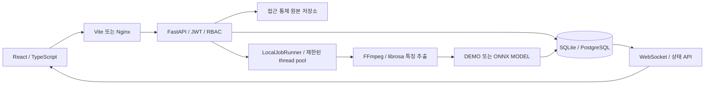
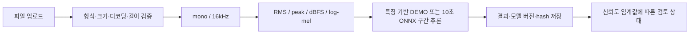
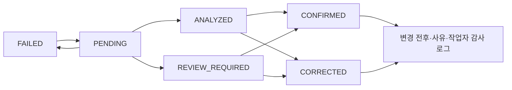

# 아키텍처

```mermaid
flowchart LR
  Browser[React / TypeScript] --> Proxy[Vite 또는 Nginx]
  Proxy --> API[FastAPI / JWT / RBAC]
  API --> DB[(SQLite / PostgreSQL)]
  API --> Storage[접근 통제 원본 저장소]
  API --> Queue[LocalJobRunner / 제한된 thread pool]
  Queue --> Audio[FFmpeg / librosa 특징 추출]
  Audio --> Inference[DEMO 또는 ONNX MODEL]
  Inference --> DB
  DB --> WS[WebSocket / 상태 API]
  WS --> Browser
```

단일 서버 프로세스 기준입니다. 시작 시 중단 작업을 FAILED로 복구합니다. 작업 큐는 2 worker·8개 슬롯이며 Celery/Redis 어댑터로 확장할 수 있습니다. 통계는 현재 Python 집계여서 대규모 환경에서는 SQL 집계·인덱스·캐시가 필요합니다.

```mermaid
flowchart LR
 Upload[파일 업로드] --> Validate[형식·크기·디코딩·길이 검증]
 Validate --> Mono[mono / 16kHz]
 Mono --> Features[RMS / peak / dBFS / log-mel]
 Features --> Predict[특징 기반 DEMO 또는 10초 ONNX 구간 추론]
 Predict --> Persist[결과·모델 버전·hash 저장]
 Persist --> Review[신뢰도 임계값에 따른 검토 상태]
```

```mermaid
flowchart LR
 ANALYZED --> CONFIRMED
 ANALYZED --> CORRECTED
 REVIEW_REQUIRED --> CONFIRMED
 REVIEW_REQUIRED --> CORRECTED
 FAILED --> PENDING
 PENDING --> ANALYZED
 PENDING --> REVIEW_REQUIRED
 PENDING --> FAILED
 CONFIRMED --> Audit[변경 전후·사유·작업자 감사 로그]
 CORRECTED --> Audit
```
